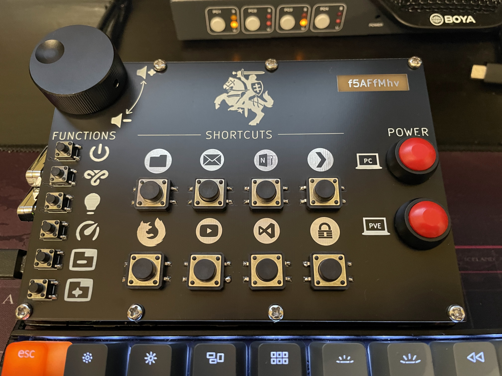

# Programmabe Keypad
This is keypad project which uses Arduino Pro Micro as keyboard emulator. Each button sends key press combination over USB which is mapped to some particular action on computer.

Some footprints in this project are custom ones. You will need to import [my footprints](https://github.com/f5AFfMhv/my-kicad-libraries) library into KiCad.

For more information about this project look at its instructables page:
* [Programmable Keypad Rev B](https://www.instructables.com/Programmable-Keypad-Rev-B/)
* [Programmable Keypad](https://www.instructables.com/Programmable-Keypad-1/)

